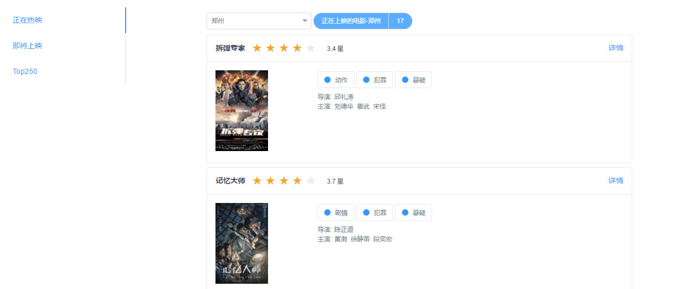

# doubanapi

> Notice:
    - vue-router多个路由地址绑定同一个组件，生命周期执行一次问题
        ```
          解决方法:在组件中
         watch: {
            '$route': function(to, from){}
         }
         ```
> vue + iview + jQuery + 豆瓣apiv2

> 预览:


## Build Setup

``` bash
# install dependencies
npm install

# serve with hot reload at localhost:8080
npm run dev

# build for production with minification
npm run build

# build for production and view the bundle analyzer report
npm run build --report

# run e2e tests
npm run e2e

# run all tests
npm test
```

For detailed explanation on how things work, checkout the [guide](http://vuejs-templates.github.io/webpack/) and [docs for vue-loader](http://vuejs.github.io/vue-loader).
